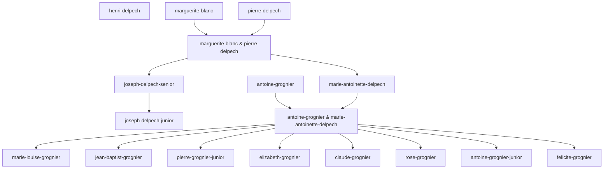

# Genealogy Tree Diagram

Generated from Builder.io person model on **2025-12-17T21:44:51.681Z**

## Overview
- **Total people**: 15
- **Root ancestors**: 4

## Mermaid Diagram

## How to Extend

To add new people to the genealogy tree:

1. Create a new person record in the **Builder.io person model**
2. Set the `personId` field to a unique kebab-case ID (e.g., `jean-doe`)
3. Fill in other fields: `givenName`, `familyName`, `displayName`, `birthDate`, `deathDate`, etc.
4. Run the generation script: `npm run generate:genealogy-tree`
5. Commit the updated `docs/genealogy-tree.md` file

## Notes

- **Person details are stored in Builder.io**: This file contains only the family tree structure (IDs and relationships)
- **Mermaid format**: The diagram uses Mermaid flowchart syntax, which is supported by GitHub, GitLab, and many markdown renderers
- **Automatic generation**: This file is auto-generated from the Builder person model — edit person records in Builder, not this file